1s
Run docker/build-push-action@v6
GitHub Actions runtime token ACs
Docker info
Proxy configuration
Buildx version
Builder info
/usr/bin/docker buildx build --cache-from type=gha --cache-to type=gha,mode=max --iidfile /home/runner/work/_temp/docker-actions-toolkit-Mp1XIq/build-iidfile-94498260a7.txt --label org.opencontainers.image.created=2026-01-18T23:44:31.053Z --label org.opencontainers.image.description=[🤝] bounty-challenge incentivizes bug discovery and software improvement through community-driven reports and suggestions, with rewards based on impact and quality. --label org.opencontainers.image.licenses=Apache-2.0 --label org.opencontainers.image.revision=bae82e6aa7ab8f664f6ea59fe7d04ae0b297350e --label org.opencontainers.image.source=https://github.com/PlatformNetwork/bounty-challenge --label org.opencontainers.image.title=bounty-challenge --label org.opencontainers.image.url=https://github.com/PlatformNetwork/bounty-challenge --label org.opencontainers.image.version=main --attest type=provenance,mode=max,builder-id=https://github.com/PlatformNetwork/bounty-challenge/actions/runs/21120652929/attempts/1 --tag ghcr.io/platformnetwork/bounty-challenge:main --tag ghcr.io/platformnetwork/bounty-challenge:latest --tag ghcr.io/platformnetwork/bounty-challenge:bae82e6 --metadata-file /home/runner/work/_temp/docker-actions-toolkit-Mp1XIq/build-metadata-62cc80043e.json --push .
#0 building with "builder-f6ca9c34-e821-4e83-8515-ee5b9e02b840" instance using docker-container driver

#1 [internal] load build definition from Dockerfile
#1 transferring dockerfile: 2B done
#1 DONE 0.0s
ERROR: failed to build: failed to solve: failed to read dockerfile: open Dockerfile: no such file or directory
Reference
Check build summary support
Error: buildx failed with: ERROR: failed to build: failed to solve: failed to read dockerfile: open Dockerfile: no such file or directory
# Bounty Challenge - Miner Guide

Complete documentation for miners participating in the Bounty Challenge.

## Table of Contents

1. [Overview](#overview)
2. [Registration Flow](#registration-flow)
3. [Creating Valid Issues](#creating-valid-issues)
4. [Reward System](#reward-system)
5. [CLI Reference](#cli-reference)
6. [API Integration](#api-integration)
7. [Best Practices](#best-practices)

---

## Overview

```mermaid
flowchart LR
    Platform["Platform Server"] --> Bridge["Bridge API"]
    Bridge --> Target["📋 bounty-challenge"]
```



### Key Components

| Component | Description |
|-----------|-------------|
| **Platform Server** | Central orchestrator at `chain.platform.network` |
| **Bridge API** | Routes all traffic through `/api/v1/bridge/bounty-challenge/` |
| **Target Repos** | PlatformNetwork/bounty-challenge (this repository) |
| **Valid Label** | Only issues with this label count for rewards |

### Where to Submit Issues

> **IMPORTANT**: All issues must be submitted to the bounty-challenge repository to receive rewards!

| Repository | Status |
|------------|--------|
| [PlatformNetwork/bounty-challenge](https://github.com/PlatformNetwork/bounty-challenge/issues) | ✅ Rewards eligible |

---

## Registration Flow


### Step-by-Step

1. **Run the Wizard**
   ```bash
   bounty
   ```

2. **Enter Your Secret Key**
   
   The CLI accepts:
   - **64-character hex seed**: `a1b2c3d4...` (32 bytes)
   - **12+ word mnemonic**: `word1 word2 word3 ...`
   - **SURI format**: `//Alice` (for testing)

3. **Verify Your Hotkey**
   
   The CLI derives your SS58 hotkey and displays it:
   ```
   ✓ Hotkey: 5GrwvaEF...vQGn
   ```

4. **Enter GitHub Username**
   
   Enter the exact username you use on GitHub (case-insensitive).

5. **Sign and Submit**
   
   The CLI:
   - Creates message: `register_github:{username}:{timestamp}`
   - Signs with sr25519
   - Submits to platform

6. **Confirmation**
   ```
   ✓ Registration successful!
   Your GitHub account @username is now linked.
   ```

### Message Format

```
register_github:{github_username_lowercase}:{unix_timestamp}
```

Example:
```
register_github:johndoe:1705590000
```

### Signature Verification

The server verifies:
1. Timestamp is within 5 minutes (replay protection)
2. Signature matches the claimed hotkey
3. Message format is correct

---

## Creating Valid Issues

> **WARNING**: Issues must be submitted to [PlatformNetwork/bounty-challenge](https://github.com/PlatformNetwork/bounty-challenge/issues) to receive rewards. Issues in other repos will NOT be counted!

### Issue Requirements

For an issue to earn rewards, it must:

1. **Be on the bounty-challenge repository** (this repo!)
2. **Be created by your registered GitHub account**
3. **Be closed by maintainers**
4. **Have the `valid` label** (added by maintainers)

### Valid Issue Types

| Type | Description | Example |
|------|-------------|---------|
| **Bug Report** | Reproducible software defects | "CLI crashes on startup with Python 3.12" |
| **Security Issue** | Vulnerabilities (responsible disclosure) | "XSS in web interface" |
| **Feature Request** | Well-reasoned feature proposals | "Add --quiet flag for CI usage" |
| **Documentation** | Doc errors, gaps, improvements | "Installation docs missing Windows steps" |

### Issue Template

```markdown
## Description
[Clear description of the bug/feature/issue]

## Steps to Reproduce (for bugs)
1. Step one
2. Step two
3. Step three

## Expected Behavior
[What should happen]

## Actual Behavior
[What actually happens]

## Environment
- OS: [e.g., Ubuntu 22.04]
- Cortex version: [e.g., 0.1.0]
- Python version: [if applicable]

## Additional Context
[Screenshots, logs, etc.]
```

### Validation Process

```mermaid
flowchart LR
    A["Issue Created"] --> B["Review"] --> C{Valid?}
    C -->|Yes| D["✅ Reward"]
    C -->|No| E["❌ Penalty"]
```



### Penalty System

> **IMPORTANT**: Invalid issues count against you! Maintain a positive balance.

**Rules:**
- **Ratio 1:1**: 1 invalid issue allowed per valid issue
- **Penalty**: If `invalid > valid`, your weight becomes 0
- **Recovery**: Submit valid issues to restore balance >= 0

**Balance Calculation:**
```
balance = valid_issues - invalid_issues

If balance >= 0: weight = normal calculation
If balance < 0:  weight = 0 (penalized)
```

**Examples:**

| Miner | Valid | Invalid | Balance | Status |
|-------|-------|---------|---------|--------|
| A | 5 | 3 | +2 | ✅ OK |
| B | 3 | 3 | 0 | ✅ OK |
| C | 2 | 4 | -2 | ❌ Penalized |
| D | 0 | 1 | -1 | ❌ Penalized |

> Miner C needs 2 more valid issues to recover. Miner D needs 1.

### Label Protection

The `valid` label is protected by GitHub Actions:
- Only authorized maintainers can add/remove it
- Unauthorized changes are automatically reverted
- A comment explains the protection

---

## Reward System

### How Rewards Work


### Formulas

**Maximum Daily Weight:**

$$W_{max} = \min\left(\frac{N_{total}}{250}, 1.0\right)$$

**Weight per Issue (Adaptive):**

$$w_{issue} = \begin{cases} 
0.01 & \text{if } N_{total} \leq 100 \\ 
0.01 \times \frac{100}{N_{total}} & \text{if } N_{total} > 100
\end{cases}$$

**User Weight:**

$$W_{user} = \min(n_{user} \times w_{issue}, W_{max})$$

### Example Calculations

**Scenario 1: Low Activity Day (50 issues total)**

| Metric | Value |
|--------|-------|
| Total issues | 50 |
| Max weight | 50/250 = 0.20 |
| Weight/issue | 0.01 |
| Your issues | 5 |
| Your weight | 5 × 0.01 = 0.05 |

**Scenario 2: High Activity Day (300 issues total)**

| Metric | Value |
|--------|-------|
| Total issues | 300 |
| Max weight | 1.0 (capped) |
| Weight/issue | 0.01 × (100/300) = 0.0033 |
| Your issues | 10 |
| Your weight | 10 × 0.0033 = 0.033 |

### Weight Reference Table

| Total Issues/24h | Max Weight | Weight/Issue | 5 Issues | 10 Issues | 20 Issues |
|-----------------|------------|--------------|----------|-----------|-----------|
| 50 | 0.20 | 0.0100 | 0.050 | 0.100 | 0.200 |
| 100 | 0.40 | 0.0100 | 0.050 | 0.100 | 0.200 |
| 150 | 0.60 | 0.0067 | 0.033 | 0.067 | 0.133 |
| 200 | 0.80 | 0.0050 | 0.025 | 0.050 | 0.100 |
| 250 | 1.00 | 0.0040 | 0.020 | 0.040 | 0.080 |
| 500 | 1.00 | 0.0020 | 0.010 | 0.020 | 0.040 |

### 24-Hour Rolling Window

- Rewards are calculated based on the last 24 hours
- As issues age past 24h, they no longer contribute to weights
- This encourages consistent, daily participation

---

## CLI Reference

### Installation

```bash
# Clone and build
git clone https://github.com/PlatformNetwork/bounty-challenge.git
cd bounty-challenge
cargo build --release

# Add to PATH
export PATH="$PWD/target/release:$PATH"
```

### Commands

#### `bounty` / `bounty wizard`

Interactive registration wizard.

```bash
bounty
```

#### `bounty status`

Check your registration status and rewards.

```bash
bounty status --hotkey 5GrwvaEF5zXb26Fz9rcQpDWS57CtERHpNehXCPcNoHGKutQY
```

Output:
```
Status for 5GrwvaEF...
  Registered: true
  GitHub: @johndoe
  Issues (24h): 5
  Weight: 0.05
```

#### `bounty leaderboard`

View current standings.

```bash
bounty leaderboard --limit 20
```

Output:
```
Rank  GitHub          Issues  Weight
1     @alice          12      0.12
2     @bob            8       0.08
3     @charlie        5       0.05
...
```

#### `bounty config`

Show challenge configuration.

```bash
bounty config
```

### Environment Variables

| Variable | Default | Description |
|----------|---------|-------------|
| `PLATFORM_URL` | `https://chain.platform.network` | Platform server URL |
| `MINER_HOTKEY` | - | Your hotkey (for status command) |

---

## API Integration

### Base URL

```
https://chain.platform.network/api/v1/bridge/bounty-challenge/
```

### Register Endpoint

**POST** `/register`

```json
{
  "hotkey": "5GrwvaEF5zXb26Fz9rcQpDWS57CtERHpNehXCPcNoHGKutQY",
  "github_username": "johndoe",
  "signature": "0x...",
  "timestamp": 1705590000
}
```

Response:
```json
{
  "success": true,
  "message": "Successfully registered @johndoe with your hotkey."
}
```

### Status Endpoint

**GET** `/status/{hotkey}`

Response:
```json
{
  "registered": true,
  "github_username": "johndoe",
  "valid_issues_count": 5,
  "weight": 0.05
}
```

### Leaderboard Endpoint

**GET** `/leaderboard?limit=20`

Response:
```json
{
  "leaderboard": [
    {
      "github_username": "alice",
      "hotkey": "5GrwvaEF...",
      "issues_resolved_24h": 12,
      "weight": 0.12
    },
    ...
  ]
}
```

### Stats Endpoint

**GET** `/stats`

Response:
```json
{
  "total_bounties": 150,
  "total_miners": 25,
  "challenge_id": "bounty-challenge",
  "version": "0.1.0"
}
```

---

## Best Practices

### Issue Quality

1. **Be specific** - Provide exact steps to reproduce
2. **Include context** - OS, version, environment
3. **One issue per report** - Don't combine multiple bugs
4. **Search first** - Check if issue already exists

### Security Issues

1. **Responsible disclosure** - Report privately first if severe
2. **Provide details** - Impact, affected versions, mitigation
3. **Don't exploit** - Report, don't abuse

### Account Security

1. **Protect your secret key** - Never share or commit it
2. **Use environment variables** - Don't hardcode keys
3. **Verify signatures** - Ensure you're signing correct messages

### Maximizing Rewards

1. **Quality over quantity** - Valid issues count, not total
2. **Consistent participation** - 24h rolling window favors daily activity
3. **Target real issues** - Maintainers reject low-quality reports
4. **Read documentation** - Understand the project before reporting

---

## Troubleshooting

### "Invalid signature" Error

- Ensure you're using the correct secret key
- Check that timestamp is current (within 5 minutes)
- Verify the message format is correct

### "Username already registered" Error

- Each GitHub username can only link to one hotkey
- Contact support to change registration

### "Hotkey already registered" Error

- Each hotkey can only link to one GitHub username
- Use a different hotkey or contact support

### Issue Not Credited

- Verify issue has `valid` label
- Check issue was created by your registered GitHub account
- Ensure issue was resolved within last 24 hours
- Wait a few minutes for validators to scan

---

## Support

- **Documentation**: This file and `/docs/` directory
- **Issues**: [GitHub Issues](https://github.com/PlatformNetwork/bounty-challenge/issues)
- **Discord**: [Cortex Foundation Discord](https://discord.gg/cortexfoundation)
