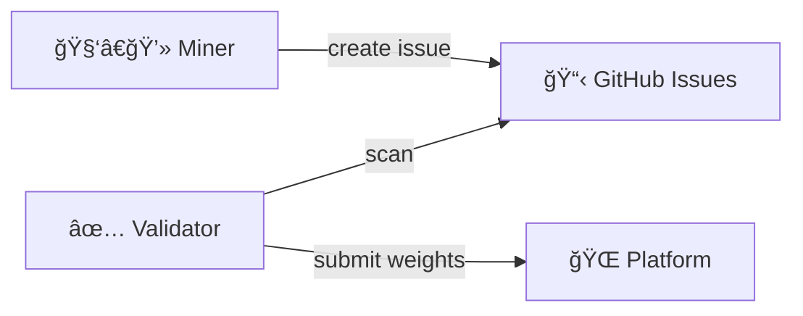
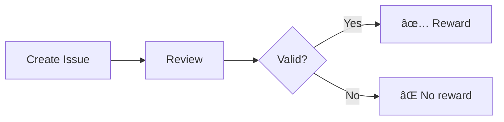
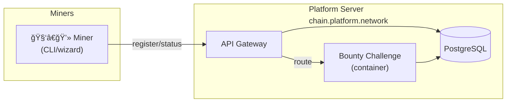

<div align="center">

# bουηtү chαllεηgε

**GitHub Issue Reward System for Cortex on Bittensor**

[](https://github.com/PlatformNetwork/bounty-challenge/actions/workflows/ci.yml)
[](https://github.com/PlatformNetwork/bounty-challenge/blob/main/LICENSE)
[](https://github.com/PlatformNetwork/bounty-challenge/stargazers)
[](https://www.rust-lang.org/)
[](https://bittensor.com/)


</div>

Bounty Challenge is a decentralized issue reward system on the Bittensor network. Miners earn TAO rewards by discovering and reporting valid issues. Issues must be closed with the `valid` label by project maintainers to qualify for rewards.

> **IMPORTANT**: To receive rewards, you MUST submit issues in **this repository** ([PlatformNetwork/bounty-challenge](https://github.com/PlatformNetwork/bounty-challenge/issues)). Issues submitted directly to other repositories will **NOT** be counted for rewards.

## Quick Links

- [Getting Started](docs/miner/getting-started.md) - Installation and first registration
- [Registration Guide](docs/miner/registration.md) - Link your GitHub account
- [Scoring & Rewards](docs/reference/scoring.md) - Weight calculation formulas
- [API Reference](docs/reference/api-reference.md) - Endpoints and payloads
- [Validator Setup](docs/validator/setup.md) - Run a validator

## Features

- **Centralized Bug Bounty**: All issues tracked in this repository
- **Points-Based Rewards**: 1 point per valid issue, 0.25 points per starred repo
- **Cryptographic Registration**: sr25519 signature-based hotkey linking
- **Real-Time Leaderboard**: Track miner standings and valid issues
- **PostgreSQL Backend**: Production-ready storage via Platform integration
- **GitHub Label Protection**: Automated label protection via GitHub Actions

## System Overview

### Core Components



### Registration Flow


### Reward Flow



## Reward System

Bounty Challenge uses a **point-based reward system**.

### Point System

Each valid issue earns you 1 point:

| Source | Points | Description |
|--------|--------|-------------|
| **Valid Issue** | 1 point | Issue closed with `valid` label |
| **Starred Repo** | 0.25 points | Each starred target repository |

### Weight Calculation

Your weight is calculated from your total points:

$$W_{user} = \min(points \times 0.02, 1.0)$$

Where:
- **50 points = 100% weight** (maximum)
- Each point = 2% weight

**Examples:**

| Miner | Valid Issues | Stars | Total Points | Weight |
|-------|-------------|-------|--------------|--------|
| A | 10 | 0 | 10 | 20% |
| B | 25 | 4 | 26 | 52% |
| C | 50 | 5 | 51.25 | 100% (capped) |

See [Scoring Documentation](docs/reference/scoring.md) for complete specifications.

### Penalty System

> **WARNING**: Issues marked with `invalid` label count against you!

| Rule | Description |
|------|-------------|
| **Penalty** | -0.5 points per invalid issue |
| **Zero Weight** | If net points < 0, weight = 0 |
| **Recovery** | Submit valid issues to restore positive balance |

**Formula:**
```
net_points = valid_issues - (invalid_issues × 0.5)
weight = net_points > 0 ? (net_points × 0.02) : 0
```

**Examples:**

| Miner | Valid | Invalid | Net Points | Weight |
|-------|-------|---------|------------|--------|
| A | 10 | 2 | 9 | 18% |
| B | 3 | 8 | -1 | 0% (penalized) |

### Star Bonus

Earn extra points by starring our repositories!

| Requirement | Bonus |
|-------------|-------|
| **Minimum** | 2 valid issues resolved |
| **Bonus** | +0.25 points per starred repo |
| **Maximum** | +1.25 points (5 repos × 0.25) |

**Repositories to star:**

| Repository | URL |
|------------|-----|
| CortexLM/vgrep | https://github.com/CortexLM/vgrep |
| CortexLM/cortex | https://github.com/CortexLM/cortex |
| PlatformNetwork/platform | https://github.com/PlatformNetwork/platform |
| PlatformNetwork/term-challenge | https://github.com/PlatformNetwork/term-challenge |
| PlatformNetwork/bounty-challenge | https://github.com/PlatformNetwork/bounty-challenge |

**Example:**
- Miner with 10 valid issues + 4 starred repos = 11 points = 22% weight
- Miner with 1 valid issue + 5 starred repos = 1 point only (need 2+ valid issues for star bonus)

## Target Repository

Submit issues about bugs, security problems, or improvements you find:

| Repository | Points per Issue | For 100% Weight | URL |
|------------|-----------------|-----------------|-----|
| **PlatformNetwork/bounty-challenge** | **1 point** | 50 issues | https://github.com/PlatformNetwork/bounty-challenge |

> **Note:** 50 points = 100% weight. Star 5 repos for an additional 1.25 points bonus!

> **Important:** All issues must be submitted to **this repository** ([PlatformNetwork/bounty-challenge](https://github.com/PlatformNetwork/bounty-challenge/issues)) to receive rewards.

## Quick Start for Miners

### Prerequisites

- **Bittensor Wallet** (miner hotkey with secret key)
- **GitHub Account** 
- **Rust** 1.70+ (to build the CLI)

### Installation

```bash
# Clone and build
git clone https://github.com/PlatformNetwork/bounty-challenge.git
cd bounty-challenge
cargo build --release

# Add to PATH
export PATH="$PWD/target/release:$PATH"

# Verify installation
bounty --version
```

### Register Your GitHub Account

Run the interactive registration wizard:

```bash
bounty
```

Or explicitly:

```bash
bounty wizard
```

The wizard will:
1. Ask for your miner **secret key** (64-char hex or 12+ word mnemonic)
2. Derive your **hotkey** (SS58 format)
3. Ask for your **GitHub username**
4. Sign the registration with sr25519
5. Submit to the platform

### Create Valid Issues

> **WARNING**: Issues must be created in **this repository** to be eligible for rewards!

> **IMPORTANT**: You MUST include the version in your issue title. Issues without a version will be automatically closed.

**Title Format:** `[TYPE] [vX.X.X] Description`

Examples:
- `[BUG] [v0.1.5] CLI crashes on startup`
- `[FEATURE] [v0.2.0] Add export to JSON`
- `[PERF] [v0.1.5] Slow response time on leaderboard`

To find your version, run: `[app cli --version]`

Go to the bounty-challenge repository and create issues:

| Repository | URL |
|------------|-----|
| **PlatformNetwork/bounty-challenge** | https://github.com/PlatformNetwork/bounty-challenge/issues |

You can report issues about the Cortex project (see Target Repository above) but they must be submitted HERE to count for rewards.

Valid issue types:

| Type | Description |
|------|-------------|
| **Bug Reports** | Reproduction steps, expected vs actual behavior |
| **Security Issues** | Vulnerabilities (follow responsible disclosure) |
| **Feature Requests** | Use cases and proposed solutions |
| **Documentation** | Gaps, errors, or improvements |

### Wait for Validation

Maintainers will review your issue:
- ✅ **Valid**: Closed with `valid` label → Reward auto-credited
- ❌ **Invalid**: Closed without label → No reward

**Note:** Only maintainers can add/remove the `valid` label. This is enforced via GitHub Actions.

### Check Your Status

```bash
bounty status --hotkey YOUR_HOTKEY
```

### View Leaderboard

```bash
bounty leaderboard
```

## CLI Commands

| Command | Description |
|---------|-------------|
| `bounty` | Interactive registration wizard (default) |
| `bounty wizard` | Same as above |
| `bounty status -k <hotkey>` | Check your status and rewards |
| `bounty leaderboard` | View current standings |
| `bounty config` | Show challenge configuration |
| `bounty server` | Run in server mode (subnet operators) |
| `bounty validate` | Run as validator (auto-scan) |

### Environment Variables

| Variable | Default | Description |
|----------|---------|-------------|
| `PLATFORM_URL` | `https://chain.platform.network` | Platform server URL |
| `DATABASE_URL` | - | PostgreSQL connection (server mode) |
| `GITHUB_TOKEN` | - | GitHub API token (increases rate limits) |
| `MINER_HOTKEY` | - | Your miner hotkey (SS58) |

## Where to Submit Issues

> **IMPORTANT**: All issues must be submitted to this repository to receive rewards.

| Repository | URL | Status |
|------------|-----|--------|
| **PlatformNetwork/bounty-challenge** | https://github.com/PlatformNetwork/bounty-challenge/issues | ✅ Rewards eligible |
| Other repositories | - | ❌ Not counted |

Report bugs, security issues, or feature requests about the Cortex project in the bounty-challenge repo.

## Anti-Abuse Mechanisms

| Mechanism | Description |
|-----------|-------------|
| **Valid Label Required** | Only issues closed with `valid` label count |
| **Signature Verification** | sr25519 signature proves hotkey ownership |
| **Author Verification** | GitHub username must match issue author |
| **First Reporter Wins** | Each issue can only be claimed once |
| **Adaptive Weights** | High activity reduces per-issue reward |
| **Maintainer Gatekeeping** | Only project members can validate issues |
| **Label Protection** | GitHub Actions prevent unauthorized label changes |

## API Reference

### Bridge API Endpoints

All requests go through the platform bridge:

```
https://chain.platform.network/api/v1/bridge/bounty-challenge/
```

| Endpoint | Method | Description |
|----------|--------|-------------|
| `/register` | POST | Register GitHub username with hotkey |
| `/status/{hotkey}` | GET | Get miner status and rewards |
| `/leaderboard` | GET | Get current standings |
| `/stats` | GET | Get challenge statistics |

### Direct Server Endpoints

| Endpoint | Method | Description |
|----------|--------|-------------|
| `/health` | GET | Health check |
| `/config` | GET | Challenge configuration |
| `/get_weights` | GET | Calculate current weights |

See [API Reference](docs/reference/api-reference.md) for complete documentation.

## Project Structure

```
bounty-challenge/
├── src/
│   ├── main.rs              # Server entry point
│   ├── lib.rs               # Library exports
│   ├── auth.rs              # Signature verification
│   ├── challenge.rs         # Challenge implementation
│   ├── config.rs            # Configuration loading
│   ├── gh_cli.rs            # GitHub CLI integration
│   ├── github.rs            # GitHub API client
│   ├── github_oauth.rs      # GitHub OAuth device flow
│   ├── metagraph.rs         # Metagraph caching
│   ├── pg_storage.rs        # PostgreSQL storage
│   ├── server.rs            # HTTP server & routes
│   └── bin/
│       ├── bounty/          # CLI application
│       │   ├── main.rs      # CLI entry point
│       │   ├── client.rs    # Bridge API client
│       │   ├── style.rs     # Terminal styling
│       │   ├── wizard/      # Registration wizard
│       │   └── commands/    # CLI commands
│       └── bounty-health-server.rs  # Health check server
├── migrations/              # PostgreSQL migrations
│   ├── 001_schema.sql
│   ├── ...
│   └── 011_fix_negative_weight.sql
├── docs/
│   ├── anti-abuse.md        # Anti-abuse documentation
│   ├── miner/               # Miner guides
│   ├── reference/           # API & scoring references
│   └── validator/           # Validator guides
├── .github/workflows/
│   ├── ci.yml               # CI pipeline
│   ├── protect-valid-label.yml  # Label protection
│   └── version-check.yml    # Version validation
├── config.toml              # Configuration
└── assets/
    └── banner.jpg           # Banner image
```

## Documentation

- **For Miners:**
  - [Getting Started](docs/miner/getting-started.md)
  - [Registration Guide](docs/miner/registration.md)

- **For Validators:**
  - [Setup Guide](docs/validator/setup.md)

- **Reference:**
  - [Scoring & Rewards](docs/reference/scoring.md)
  - [API Reference](docs/reference/api-reference.md)
  - [Anti-Abuse Mechanisms](docs/anti-abuse.md)

## Development

### Building

```bash
# Debug build
cargo build

# Release build
cargo build --release

# Run tests
cargo test

# Run with logging
RUST_LOG=info cargo run
```

### Code Quality

```bash
# Format code
cargo fmt

# Run linter
cargo clippy

# Check without building
cargo check
```

## Platform Integration

When deployed as a Platform challenge module:



## Acknowledgments

- [Cortex Foundation](https://github.com/CortexLM) for the Cortex ecosystem
- [Platform Network](https://github.com/PlatformNetwork) for the challenge SDK
- [Bittensor](https://bittensor.com/) for the decentralized AI network

## License

Apache-2.0
