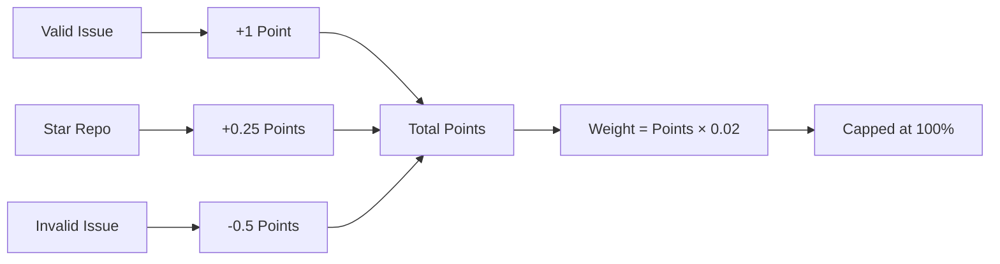

# Scoring & Rewards

Complete specification of the reward system for Bounty Challenge.

## Table of Contents

1. [Overview](#overview)
2. [Points System](#points-system)
3. [Weight Calculation](#weight-calculation)
4. [Star Bonus](#star-bonus)
5. [Penalty System](#penalty-system)
6. [Bittensor Integration](#bittensor-integration)
7. [Examples](#examples)

---

## Overview

Bounty Challenge uses a **points-based reward system** designed to:
1. **Incentivize quality** - Valid issues earn points
2. **Reward engagement** - Starring repos adds bonus points
3. **Prevent abuse** - Invalid issues deduct points
4. **Ensure fairness** - Simple, transparent scoring

### Key Principles

| Principle | Implementation |
|-----------|---------------|
| **Point-Based** | 1 point per valid issue |
| **Star Bonus** | 0.25 points per starred repo |
| **Penalty System** | Invalid issues reduce balance |
| **Quality Gate** | Only `valid` labeled issues count |

---

## Points System

### Earning Points

| Source | Points | Description |
|--------|--------|-------------|
| **Valid Issue** | 1 point | Issue closed with `valid` label |
| **Starred Repo** | 0.25 points | Each starred target repository |

### Point Requirements

| Points | Weight | Description |
|--------|--------|-------------|
| 0 | 0% | No valid contributions |
| 25 | 50% | 25 valid issues |
| 50 | 100% | Maximum weight reached |
| 50+ | 100% | Capped at 100% |

### Points Formula

$$points = issues_{valid} + (stars \times 0.25)$$

---

## Weight Calculation

### Formula

Your weight is calculated directly from your total points:

$$W_{user} = \min(points \times 0.02, 1.0)$$

Where:
- $W_{user}$ = Your total weight (0.0 to 1.0)
- $points$ = Total points (valid issues + star bonus)
- 0.02 = Weight per point (2% per point)
- 1.0 = Maximum weight cap (100%)

### Constants

```rust
// Maximum points for full weight (100%)
MAX_POINTS_FOR_FULL_WEIGHT = 50.0

// Weight earned per point (2% = 0.02)
WEIGHT_PER_POINT = 0.02
```

### Weight Table

| Points | Weight | Calculation |
|--------|--------|-------------|
| 1 | 2% | 1 × 0.02 = 0.02 |
| 5 | 10% | 5 × 0.02 = 0.10 |
| 10 | 20% | 10 × 0.02 = 0.20 |
| 25 | 50% | 25 × 0.02 = 0.50 |
| 50 | 100% | 50 × 0.02 = 1.00 |
| 100 | 100% | Capped at 1.0 |

---

## Star Bonus

### Eligible Repositories

Earn 0.25 points by starring each of these repositories:

| Repository | URL |
|------------|-----|
| CortexLM/vgrep | https://github.com/CortexLM/vgrep |
| CortexLM/cortex | https://github.com/CortexLM/cortex |
| PlatformNetwork/platform | https://github.com/PlatformNetwork/platform |
| PlatformNetwork/term-challenge | https://github.com/PlatformNetwork/term-challenge |
| PlatformNetwork/bounty-challenge | https://github.com/PlatformNetwork/bounty-challenge |

### Requirements

- **Minimum**: 2 valid issues resolved before star bonus applies
- **Bonus**: 0.25 points per starred repo
- **Maximum**: 1.25 points (5 repos × 0.25)

### Examples

| Miner | Valid Issues | Stars | Issue Points | Star Points | Total | Weight |
|-------|-------------|-------|--------------|-------------|-------|--------|
| A | 10 | 0 | 10 | 0 | 10 | 20% |
| B | 10 | 4 | 10 | 1.0 | 11 | 22% |
| C | 45 | 5 | 45 | 1.25 | 46.25 | 92.5% |
| D | 50 | 5 | 50 | 1.25 | 51.25 | 100% (capped) |

---

## Penalty System

### Invalid Issues

Issues marked with the `invalid` label incur penalties:

| Action | Effect |
|--------|--------|
| **Invalid Issue** | -0.5 penalty points |

### Balance Calculation

$$balance = valid_{issues} - (invalid_{issues} \times 0.5)$$

If `balance < 0`, your weight becomes **0** (penalized).

### Recovery

To recover from penalty status:
1. Submit new valid issues
2. Accumulate positive balance
3. Weight returns when balance ≥ 0

### Examples

| Miner | Valid | Invalid | Balance | Status |
|-------|-------|---------|---------|--------|
| A | 5 | 2 | 4 | ✅ OK |
| B | 3 | 8 | -1 | ❌ Penalized |
| C | 10 | 0 | 10 | ✅ OK |

---

## Bittensor Integration

### Weight Submission

Weights are submitted to Bittensor without normalization:
- Each user's weight represents their actual earned percentage
- Total weights may sum to less than 1.0
- Remainder goes to burn (handled by validator)

### On-Chain Format

Weights are converted to u16 for on-chain storage:

$$W_{chain} = \lfloor W_{user} \times 65535 \rfloor$$

---

## Examples

### Example 1: New Miner

```
Miner registers and submits 5 valid issues:
  Points: 5 issues × 1 point = 5 points
  Weight: 5 × 0.02 = 0.10 (10%)
```

### Example 2: Active Miner with Stars

```
Miner has 20 valid issues and starred 4 repos:
  Issue Points: 20 × 1 = 20
  Star Points: 4 × 0.25 = 1.0
  Total: 21 points
  Weight: 21 × 0.02 = 0.42 (42%)
```

### Example 3: Maximum Weight

```
Miner has 48 valid issues and starred 5 repos:
  Issue Points: 48 × 1 = 48
  Star Points: 5 × 0.25 = 1.25
  Total: 49.25 points
  Weight: 49.25 × 0.02 = 0.985 (98.5%)

If they get 2 more valid issues:
  Total: 51.25 points
  Weight: min(51.25 × 0.02, 1.0) = 1.0 (100% capped)
```

### Example 4: Penalized Miner

```
Miner has 3 valid issues but 8 invalid issues:
  Valid Points: 3
  Penalty Points: 8 × 0.5 = 4
  Net Points: 3 - 4 = -1 (negative)
  Weight: 0 (penalized)

To recover, they need 3 more valid issues:
  Net Points: 6 - 4 = 2 (positive)
  Weight: 2 × 0.02 = 0.04 (4%)
```

---

## Configuration

### Default Parameters

| Parameter | Value | Description |
|-----------|-------|-------------|
| `max_points_for_full_weight` | 50 | Points for 100% weight |
| `weight_per_point` | 0.02 | Weight earned per point |
| `valid_label` | "valid" | Required label for rewards |
| `star_bonus_per_repo` | 0.25 | Points per starred repo |
| `invalid_penalty` | 0.5 | Points deducted per invalid |
| `min_valid_for_stars` | 2 | Min valid issues for star bonus |

### Configuration File

In `config.toml`:

```toml
[rewards]
max_points_for_full_weight = 50
weight_per_point = 0.02
valid_label = "valid"
```

---

## Summary


