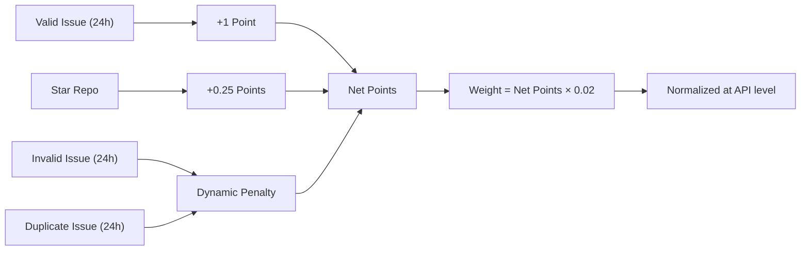

# Scoring & Rewards

Complete specification of the reward system for Bounty Challenge.

## Table of Contents

1. [Overview](#overview)
2. [Points System](#points-system)
3. [Weight Calculation](#weight-calculation)
4. [Star Bonus](#star-bonus)
5. [Penalty System](#penalty-system)
6. [Bittensor Integration](#bittensor-integration)
7. [Examples](#examples)

---

## Overview

Bounty Challenge uses a **points-based reward system** designed to:
1. **Incentivize quality** - Valid issues earn points
2. **Reward engagement** - Starring repos adds bonus points
3. **Prevent abuse** - Invalid and duplicate issues incur penalties
4. **Ensure fairness** - Simple, transparent scoring

> **Important:** All calculations are based on a **24-hour rolling window**. Only issues resolved/recorded within the last 24 hours are counted.

### Key Principles

| Principle | Implementation |
|-----------|---------------|
| **Point-Based** | 1 point per valid issue |
| **Star Bonus** | 0.25 points per starred repo |
| **Penalty System** | Invalid and duplicate issues reduce balance |
| **Quality Gate** | Only `valid` labeled issues count |
| **24h Window** | All calculations use a rolling 24-hour window |

---

## Points System

### Earning Points

| Source | Points | Description |
|--------|--------|-------------|
| **Valid Issue** | 1 point | Issue closed with `valid` label (within 24h) |
| **Starred Repo** | 0.25 points | Each starred target repository |

### Points Formula

$$net\_points = valid\_count + star\_bonus - penalty$$

Where:
- `valid_count` = number of valid issues in the last 24 hours
- `star_bonus` = starred repos count × 0.25 (requires ≥ 2 valid issues)
- `penalty` = see [Penalty System](#penalty-system)

---

## Weight Calculation

### Formula

Your raw weight is calculated directly from your net points:

$$W_{user} = net\_points \times 0.02$$

Where:
- $W_{user}$ = Your raw weight (no cap applied at calculation level)
- $net\_points$ = Valid issues + star bonus - penalty
- 0.02 = Weight per point (2% per point)

> **Note:** Weight is computed as a raw value (`points * 0.02`) and is **not capped** at the calculation level. Normalization is handled at the API level when weights are submitted.

If `net_points <= 0`, your weight is **0** (penalized).

### Constants

```rust
// Weight earned per point (2% = 0.02)
WEIGHT_PER_POINT = 0.02
```

### Weight Table

| Net Points | Weight | Calculation |
|------------|--------|-------------|
| 0 or less | 0% | Penalized |
| 1 | 2% | 1 × 0.02 = 0.02 |
| 5 | 10% | 5 × 0.02 = 0.10 |
| 10 | 20% | 10 × 0.02 = 0.20 |
| 25 | 50% | 25 × 0.02 = 0.50 |
| 50 | 100% | 50 × 0.02 = 1.00 |
| 100 | 200% | 100 × 0.02 = 2.00 (no cap) |

---

## Star Bonus

### Eligible Repositories

Earn 0.25 points by starring each of these repositories:

| Repository | URL |
|------------|-----|
| CortexLM/vgrep | https://github.com/CortexLM/vgrep |
| CortexLM/cortex | https://github.com/CortexLM/cortex |
| PlatformNetwork/platform | https://github.com/PlatformNetwork/platform |
| PlatformNetwork/term-challenge | https://github.com/PlatformNetwork/term-challenge |
| PlatformNetwork/bounty-challenge | https://github.com/PlatformNetwork/bounty-challenge |

### Requirements

- **Minimum**: 2 valid issues resolved before star bonus applies
- **Bonus**: 0.25 points per starred repo
- **Maximum**: 1.25 points (5 repos × 0.25)

### Examples

| Miner | Valid Issues | Stars | Issue Points | Star Points | Net Points | Weight |
|-------|-------------|-------|--------------|-------------|------------|--------|
| A | 10 | 0 | 10 | 0 | 10 | 20% |
| B | 10 | 4 | 10 | 1.0 | 11 | 22% |
| C | 45 | 5 | 45 | 1.25 | 46.25 | 92.5% |
| D | 50 | 5 | 50 | 1.25 | 51.25 | 102.5% (raw, normalized at API level) |

---

## Penalty System

### Overview

Penalties are applied separately for **invalid** and **duplicate** issues. Each penalty type is calculated independently against the valid issue count.

### Invalid Issues

Issues marked with the `invalid` label incur dynamic penalties:

| Condition | Penalty |
|-----------|---------|
| `invalid_count <= valid_count` | 0 points (no penalty) |
| `invalid_count > valid_count` | `invalid_count - valid_count` points |

### Duplicate Issues

Issues marked with the `duplicate` label also incur separate dynamic penalties:

| Condition | Penalty |
|-----------|---------|
| `duplicate_count <= valid_count` | 0 points (no penalty) |
| `duplicate_count > valid_count` | `duplicate_count - valid_count` points |

### Unified Penalty Formula

$$penalty = \max(0, invalid\_count - valid\_count) + \max(0, duplicate\_count - valid\_count)$$

$$net\_points = valid\_count + star\_bonus - penalty$$

If `net_points <= 0`, weight becomes **0** (penalized).

> **Note:** Invalid and duplicate penalties are computed separately. Each type only triggers a penalty when its count exceeds the valid issue count.

### Dynamic Penalty Examples

| Valid | Invalid | Duplicate | Invalid Penalty | Duplicate Penalty | Total Penalty | Net Points |
|-------|---------|-----------|-----------------|-------------------|---------------|------------|
| 5 | 3 | 2 | 0 | 0 | 0 | 5 |
| 5 | 7 | 2 | 2 | 0 | 2 | 3 |
| 5 | 3 | 8 | 0 | 3 | 3 | 2 |
| 5 | 7 | 8 | 2 | 3 | 5 | 0 |
| 2 | 6 | 4 | 4 | 2 | 6 | -4 (penalized) |

### Recovery

To recover from penalty status:
1. Submit new valid issues (within the 24h window)
2. Accumulate positive net points
3. Weight returns when net_points > 0

### Examples

| Miner | Valid | Invalid | Duplicate | Penalty | Net Points | Status |
|-------|-------|---------|-----------|---------|------------|--------|
| A | 5 | 2 | 1 | 0 | 5 | OK |
| B | 3 | 8 | 0 | 5 | -2 | Penalized |
| C | 10 | 0 | 0 | 0 | 10 | OK |
| D | 4 | 6 | 6 | 4 | 0 | Penalized |

---

## Bittensor Integration

### Weight Submission

Weights are submitted to Bittensor as raw values:
- Each user's weight is `net_points * 0.02`
- Normalization is handled at the API level
- Remainder goes to burn (handled by validator)

### On-Chain Format

Weights are converted to u16 for on-chain storage:

$$W_{chain} = \lfloor W_{user} \times 65535 \rfloor$$

---

## Examples

### Example 1: New Miner

```
Miner registers and submits 5 valid issues (within 24h):
  Valid Points: 5 issues × 1 point = 5 points
  Penalty: 0 (no invalid or duplicate issues)
  Net Points: 5
  Weight: 5 × 0.02 = 0.10 (10%)
```

### Example 2: Active Miner with Stars

```
Miner has 20 valid issues (24h) and starred 4 repos:
  Issue Points: 20 × 1 = 20
  Star Points: 4 × 0.25 = 1.0
  Penalty: 0
  Net Points: 21
  Weight: 21 × 0.02 = 0.42 (42%)
```

### Example 3: High-Activity Miner

```
Miner has 48 valid issues (24h) and starred 5 repos:
  Issue Points: 48 × 1 = 48
  Star Points: 5 × 0.25 = 1.25
  Penalty: 0
  Net Points: 49.25
  Weight: 49.25 × 0.02 = 0.985 (98.5%)

If they get 2 more valid issues:
  Net Points: 51.25
  Weight: 51.25 × 0.02 = 1.025 (raw, normalized at API level)
```

### Example 4: Dynamic Penalty (Invalid Only)

```
Miner has 3 valid issues, 8 invalid issues, 0 duplicate:
  Valid Points: 3
  Invalid Penalty: max(0, 8 - 3) = 5
  Duplicate Penalty: 0
  Net Points: 3 - 5 = -2 (negative)
  Weight: 0 (penalized)

To recover, they need 3 more valid issues:
  Valid: 6, Invalid: 8
  Invalid Penalty: max(0, 8 - 6) = 2
  Net Points: 6 - 2 = 4 (positive)
  Weight: 4 × 0.02 = 0.08 (8%)
```

### Example 5: Dynamic Penalty (Invalid + Duplicate)

```
Miner has 5 valid issues, 7 invalid issues, 8 duplicate issues:
  Valid Points: 5
  Invalid Penalty: max(0, 7 - 5) = 2
  Duplicate Penalty: max(0, 8 - 5) = 3
  Total Penalty: 2 + 3 = 5
  Net Points: 5 - 5 = 0
  Weight: 0 (penalized)
```

---

## Configuration

### Default Parameters

| Parameter | Value | Description |
|-----------|-------|-------------|
| `weight_per_point` | 0.02 | Weight earned per point |
| `valid_label` | "valid" | Required label for rewards |
| `star_bonus_per_repo` | 0.25 | Points per starred repo |
| `invalid_penalty` | dynamic | max(0, invalid - valid) |
| `duplicate_penalty` | dynamic | max(0, duplicate - valid) |
| `min_valid_for_stars` | 2 | Min valid issues for star bonus |
| `time_window` | 24 hours | Rolling window for calculations |

### Configuration File

In `config.toml`:

```toml
[rewards]
weight_per_point = 0.02
valid_label = "valid"
```

---

## Summary


