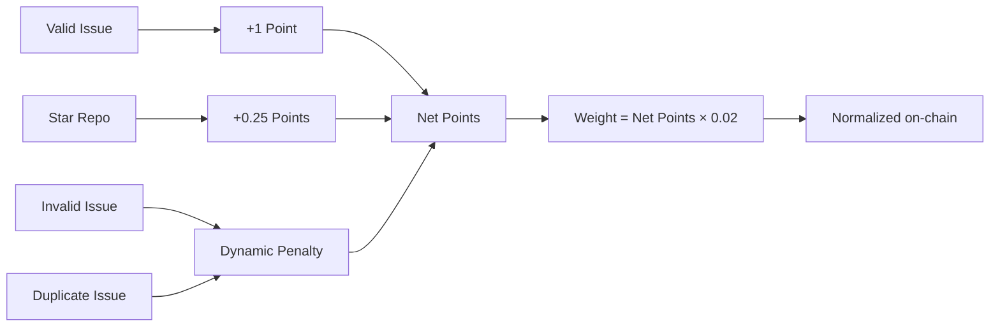

# Scoring & Rewards

Complete specification of the reward system for Bounty Challenge.

## Table of Contents

1. [Overview](#overview)
2. [Points System](#points-system)
3. [Weight Calculation](#weight-calculation)
4. [Star Bonus](#star-bonus)
5. [Penalty System](#penalty-system)
6. [Bittensor Integration](#bittensor-integration)
7. [Examples](#examples)

---

## Overview

Bounty Challenge uses a **points-based reward system** designed to:
1. **Incentivize quality** - Valid issues earn points
2. **Reward engagement** - Starring repos adds bonus points
3. **Prevent abuse** - Invalid and duplicate issues incur penalties
4. **Ensure fairness** - Simple, transparent scoring

### Key Principles

| Principle | Implementation |
|-----------|---------------|
| **Point-Based** | 1 point per valid issue |
| **Star Bonus** | 0.25 points per starred repo |
| **Penalty System** | Invalid and duplicate issues reduce balance |
| **Quality Gate** | Only `valid` labeled issues count |

---

## Points System

### Earning Points

| Source | Points | Description |
|--------|--------|-------------|
| **Valid Issue** | 1 point | Issue closed with `valid` label |
| **Starred Repo** | 0.25 points | Each starred target repository |

### Points Formula

$$net\_points = valid\_count + star\_bonus - penalty$$

Where:
- `valid_count` = number of valid issues
- `star_bonus` = starred repos count × 0.25
- `penalty` = see [Penalty System](#penalty-system)

---

## Weight Calculation

### Formula

Your raw weight is calculated directly from your net points:

$$W_{user} = net\_points \times 0.02$$

Where:
- $W_{user}$ = Your raw weight
- $net\_points$ = Valid issues + star bonus - penalty
- 0.02 = Weight per point (2% per point)

> **Note:** Weights are normalized to sum to 1.0 across all non-penalized miners when submitted on-chain.

If `net_points <= 0`, your weight is **0** (penalized).

### Constants

These constants are defined in `src/scoring.rs`:

```rust
pub const WEIGHT_PER_POINT: f64 = 0.02;
pub const STAR_BONUS_PER_REPO: f64 = 0.25;
```

### Weight Table

| Net Points | Weight | Calculation |
|------------|--------|-------------|
| 0 or less | 0% | Penalized |
| 1 | 2% | 1 × 0.02 = 0.02 |
| 5 | 10% | 5 × 0.02 = 0.10 |
| 10 | 20% | 10 × 0.02 = 0.20 |
| 25 | 50% | 25 × 0.02 = 0.50 |
| 50 | 100% | 50 × 0.02 = 1.00 |
| 100 | 200% | 100 × 0.02 = 2.00 (raw, normalized on-chain) |

---

## Star Bonus

### Eligible Repositories

Earn 0.25 points by starring each of these repositories:

| Repository | URL |
|------------|-----|
| CortexLM/vgrep | https://github.com/CortexLM/vgrep |
| CortexLM/cortex | https://github.com/CortexLM/cortex |
| PlatformNetwork/platform | https://github.com/PlatformNetwork/platform |
| PlatformNetwork/term-challenge | https://github.com/PlatformNetwork/term-challenge |
| PlatformNetwork/bounty-challenge | https://github.com/PlatformNetwork/bounty-challenge |

### Details

- **Bonus**: 0.25 points per starred repo
- **Maximum**: 1.25 points (5 repos × 0.25)

### Examples

| Miner | Valid Issues | Stars | Issue Points | Star Points | Net Points | Weight |
|-------|-------------|-------|--------------|-------------|------------|--------|
| A | 10 | 0 | 10 | 0 | 10 | 20% |
| B | 10 | 4 | 10 | 1.0 | 11 | 22% |
| C | 45 | 5 | 45 | 1.25 | 46.25 | 92.5% |
| D | 50 | 5 | 50 | 1.25 | 51.25 | 102.5% (raw, normalized on-chain) |

---

## Penalty System

> **TL;DR:** Your valid issues act as a **separate shield** against each penalty type. Invalid and duplicate penalties are calculated **independently** -- your valid count is compared against each one on its own. Only the excess above your valid count is penalized.

### How Penalties Work

There are two types of bad issues that can hurt your score:

| Label | Meaning |
|-------|---------|
| `invalid` | The issue was rejected as not a real bug or not useful |
| `duplicate` | The issue was already reported by someone else |

Each type is penalized **independently**. Your valid issue count serves as a forgiveness threshold for each type separately. You are only penalized for the excess beyond that threshold.

**Invalid penalty:**
$$penalty_{invalid} = \max(0, \; invalid\_count - valid\_count)$$

**Duplicate penalty:**
$$penalty_{duplicate} = \max(0, \; duplicate\_count - valid\_count)$$

**Total penalty:**
$$penalty = penalty_{invalid} + penalty_{duplicate}$$

**Net points (final score):**
$$net\_points = valid\_count + star\_bonus - penalty$$

If `net_points <= 0`, your weight becomes **0** (penalized).

### Why Separate Penalties?

This is the most important detail to understand. The two penalty types are **not** combined before comparison. Each one is checked against your valid count on its own.

This matters because the results are different:

| Approach | Formula | 5 valid, 4 invalid, 4 duplicate |
|----------|---------|----------------------------------|
| **Combined** (NOT how it works) | `max(0, (4+4) - 5) = 3` | 3 penalty points |
| **Separate** (how it actually works) | `max(0, 4-5) + max(0, 4-5) = 0 + 0 = 0` | 0 penalty points |

In the separate model, as long as each individual type stays at or below your valid count, you get no penalty at all -- even if the combined total exceeds your valid count.

### Step-by-Step Examples

**Scenario 1 -- Clean miner (no penalties)**

```
Valid: 5, Invalid: 3, Duplicate: 2
  Invalid penalty:   max(0, 3 - 5) = 0   (3 <= 5, forgiven)
  Duplicate penalty: max(0, 2 - 5) = 0   (2 <= 5, forgiven)
  Total penalty: 0
  Net points: 5 - 0 = 5
  Weight: 5 × 0.02 = 10%
```

**Scenario 2 -- Only invalid issues exceed threshold**

```
Valid: 5, Invalid: 7, Duplicate: 2
  Invalid penalty:   max(0, 7 - 5) = 2   (7 > 5, excess = 2)
  Duplicate penalty: max(0, 2 - 5) = 0   (2 <= 5, forgiven)
  Total penalty: 2
  Net points: 5 - 2 = 3
  Weight: 3 × 0.02 = 6%
```

**Scenario 3 -- Only duplicate issues exceed threshold**

```
Valid: 5, Invalid: 3, Duplicate: 8
  Invalid penalty:   max(0, 3 - 5) = 0   (3 <= 5, forgiven)
  Duplicate penalty: max(0, 8 - 5) = 3   (8 > 5, excess = 3)
  Total penalty: 3
  Net points: 5 - 3 = 2
  Weight: 2 × 0.02 = 4%
```

**Scenario 4 -- Both types exceed threshold**

```
Valid: 5, Invalid: 7, Duplicate: 8
  Invalid penalty:   max(0, 7 - 5) = 2
  Duplicate penalty: max(0, 8 - 5) = 3
  Total penalty: 2 + 3 = 5
  Net points: 5 - 5 = 0
  Weight: 0 (penalized)
```

**Scenario 5 -- Heavily penalized**

```
Valid: 2, Invalid: 6, Duplicate: 4
  Invalid penalty:   max(0, 6 - 2) = 4
  Duplicate penalty: max(0, 4 - 2) = 2
  Total penalty: 4 + 2 = 6
  Net points: 2 - 6 = -4 (negative)
  Weight: 0 (penalized)
```

### Recovery

To recover from penalty status:
1. Submit new valid issues
2. As your valid count rises, each penalty threshold rises with it
3. Weight returns as soon as `net_points > 0`

### Summary Table

| Miner | Valid | Invalid | Duplicate | Inv. Penalty | Dup. Penalty | Total Penalty | Net Points | Status |
|-------|-------|---------|-----------|--------------|--------------|---------------|------------|--------|
| A | 5 | 2 | 1 | 0 | 0 | 0 | 5 | OK |
| B | 5 | 7 | 2 | 2 | 0 | 2 | 3 | OK |
| C | 5 | 3 | 8 | 0 | 3 | 3 | 2 | OK |
| D | 5 | 7 | 8 | 2 | 3 | 5 | 0 | Penalized |
| E | 2 | 6 | 4 | 4 | 2 | 6 | -4 | Penalized |

---

## Bittensor Integration

### Weight Submission

Weights are calculated by the WASM module's `get_weights()` function:
- Each user's raw weight is `net_points * 0.02`
- Weights are normalized to sum to 1.0 across all non-penalized miners
- The Platform validator submits these weights on-chain

### On-Chain Format

Weights are converted to u16 for on-chain storage:

$$W_{chain} = \lfloor W_{user} \times 65535 \rfloor$$

---

## Examples

### Example 1: New Miner

```
Miner registers and submits 5 valid issues:
  Valid Points: 5 issues × 1 point = 5 points
  Penalty: 0 (no invalid or duplicate issues)
  Net Points: 5
  Weight: 5 × 0.02 = 0.10 (10%)
```

### Example 2: Active Miner with Stars

```
Miner has 20 valid issues and starred 4 repos:
  Issue Points: 20 × 1 = 20
  Star Points: 4 × 0.25 = 1.0
  Penalty: 0
  Net Points: 21
  Weight: 21 × 0.02 = 0.42 (42%)
```

### Example 3: High-Activity Miner

```
Miner has 48 valid issues and starred 5 repos:
  Issue Points: 48 × 1 = 48
  Star Points: 5 × 0.25 = 1.25
  Penalty: 0
  Net Points: 49.25
  Weight: 49.25 × 0.02 = 0.985 (98.5%)

If they get 2 more valid issues:
  Net Points: 51.25
  Weight: 51.25 × 0.02 = 1.025 (raw, normalized on-chain)
```

### Example 4: Dynamic Penalty (Invalid Only)

```
Miner has 3 valid issues, 8 invalid issues, 0 duplicate:
  Valid Points: 3
  Invalid Penalty: max(0, 8 - 3) = 5
  Duplicate Penalty: 0
  Net Points: 3 - 5 = -2 (negative)
  Weight: 0 (penalized)

To recover, they need 3 more valid issues:
  Valid: 6, Invalid: 8
  Invalid Penalty: max(0, 8 - 6) = 2
  Net Points: 6 - 2 = 4 (positive)
  Weight: 4 × 0.02 = 0.08 (8%)
```

### Example 5: Dynamic Penalty (Invalid + Duplicate)

```
Miner has 5 valid issues, 7 invalid issues, 8 duplicate issues:
  Valid Points: 5
  Invalid Penalty: max(0, 7 - 5) = 2
  Duplicate Penalty: max(0, 8 - 5) = 3
  Total Penalty: 2 + 3 = 5
  Net Points: 5 - 5 = 0
  Weight: 0 (penalized)
```

---

## Default Parameters

| Parameter | Value | Description |
|-----------|-------|-------------|
| `WEIGHT_PER_POINT` | 0.02 | Weight earned per point |
| `STAR_BONUS_PER_REPO` | 0.25 | Points per starred repo |
| `valid_label` | "valid" | Required label for rewards |
| `invalid_penalty` | dynamic | max(0, invalid - valid) |
| `duplicate_penalty` | dynamic | max(0, duplicate - valid) |

---

## Summary


